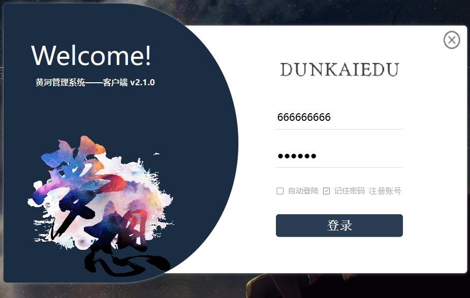
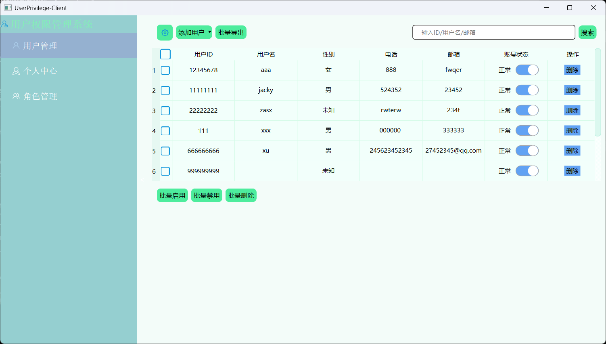
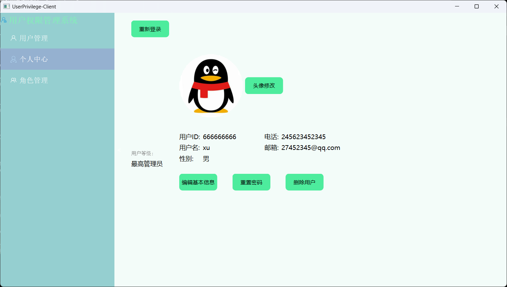
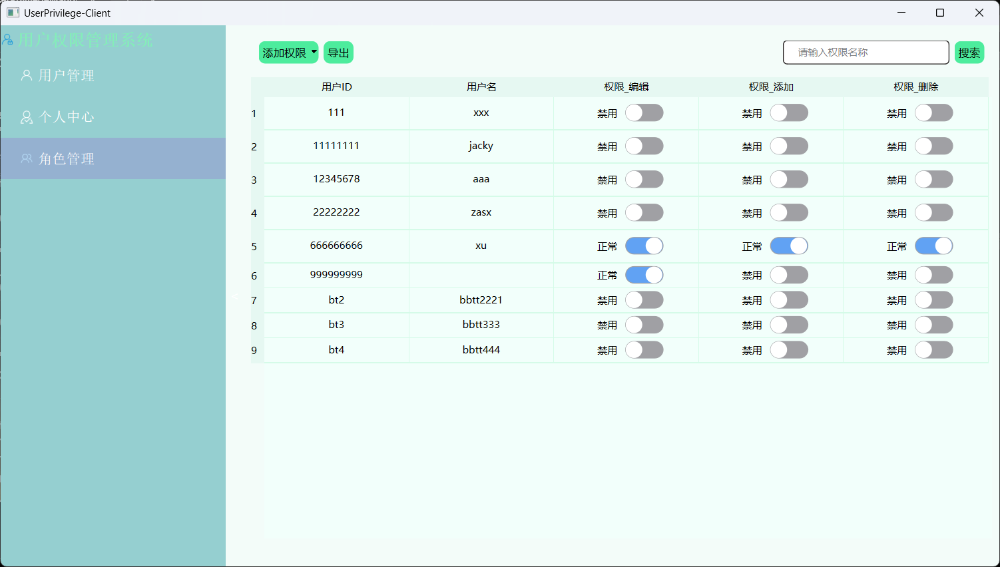
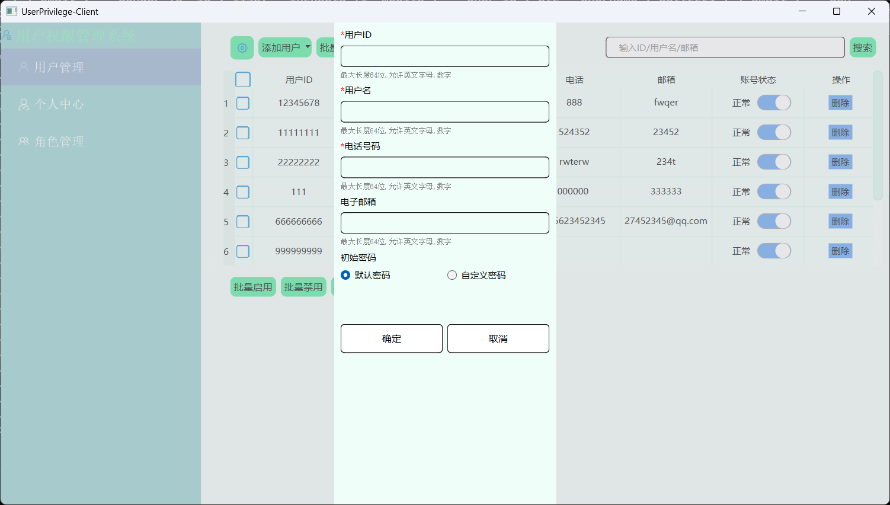

# UserManagerSystem
基于Qt6的用户权限管理系统
采用C/S架构、mvc架构，前后端分离，模块 化管理，使用模型视图框架、代理。登录模块采用JWT技术,后端模块使用QHttpServer，使用Json传输、解析数据，采用 数据库连接池实现MySql连接复用和负载均衡，自定义登录、注册控件和事件处理，个性化界面定制。

登录界面

用户界面

个人中心

权限管理界面

个人信息编辑界面

